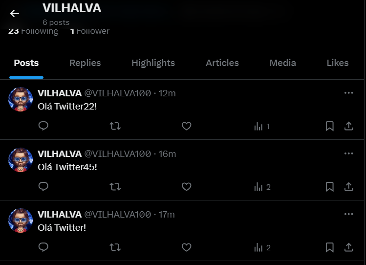

# POSTAGEM COM TWIT
🚀ESTE BOT SERVE PARA AUTOMATIZAR POSTAGENS NO TWITTER.

 <br>

## DESCRIÇÃO:
Este bot serve para automatizar postagens no Twitter. Ele é fácil de configurar e usar, lendo as credenciais de um arquivo `.env` e o texto do tweet de um arquivo `MENSAGEM.json`.

## FUNCIONALIDADES:
1. **Autenticação Automática**: O bot autentica automaticamente com a API do Twitter usando credenciais armazenadas de forma segura.
2. **Postagem Automatizada**: Lê o texto de um tweet de um arquivo JSON e faz a postagem automaticamente no Twitter.
3. **Atualização Fácil de Mensagem**: Permite alterar a mensagem do tweet facilmente editando um arquivo JSON, sem precisar modificar o código do bot.

## EXECUTANDO O PROJETO:
1. **Autenticação como Desenvolvedor:**
   - Acesse o [Twitter Developer Portal](https://developer.twitter.com/) e inscreva-se para uma conta de desenvolvedor.
   - Crie um novo projeto e, dentro deste projeto, crie um novo aplicativo. O Twitter fornecerá as chaves e tokens de acesso necessários: Consumer_key, Consumer_secret, Bearer token, Access Token, e Access Token Secret.
   - Edite o arquivo `./CODIGO/.env` com suas credenciais:
     ```plaintext
      consumer_key=API_KEY
      consumer_secret=API_SECRET
      bearer_token=BEARER_TOKEN
      access_token=ACCESS_TOKEN
      access_token_secret=ACCESS_TOKEN_SECRET
     ```

2. **Instalando as Depêndencias:**
   - Para instalar as dependências listadas no arquivo "package.json", você pode usar o comando `npm install` no terminal. Certifique-se de estar no diretório do seu projeto onde o arquivo "package.json" está localizado (`CODIGO`). O npm irá ler o arquivo "package.json" e instalar todas as dependências listadas nele. 

   ```bash
   npm install
   ```

3. **Editando o `MENSAGEM.json`:**
   - A sintaxe correta para o arquivo `./CODIGO/MENSAGEM.json` deve ser:

   ```json
   {
      "tweet_text": "Olá Twitter22!"
   }
   ```

   - Certifique-se de que o arquivo esteja formatado corretamente como JSON.
   - Substitua `"Olá Twitter22!"` pelo texto que deseja que o bot publique no Twitter.

   Exemplo:

   ```json
   {
      "tweet_text": "Este é um tweet automatizado usando tweepy e Python! 🚀"
   }
   ```

   Depois de salvar o arquivo, o bot usará o texto especificado em `tweet_text` para criar o tweet.

4. **Inicie o Bot:**
   - Para usar o `NODE`, inicie o bot com o seguinte comando:
    ```bash
    npm start
    ```

    - Para usar o `NODEMON`, inicie o bot com o seguinte comando:
    ```bash
    npm test
    ```

## NÃO SABE?
- Entendemos que para manipular arquivos em muitas linguagens e tecnologias relacionadas, é necessário possuir conhecimento nessas áreas. Para auxiliar nesse aprendizado, oferecemos cursos gratuitos disponíveis:
* [CURSO DE TWIT](https://github.com/VILHALVA/CURSO-DE-TWIT)
* [CURSO DE JAVASCRIPT](https://github.com/VILHALVA/CURSO-DE-JAVASCRIPT)
* [CURSO DE NODEJS](https://github.com/VILHALVA/CURSO-DE-NODEJS)
* [CURSO DE JSON](https://github.com/VILHALVA/CURSO-DE-JSON)
* [CONFIRA MAIS CURSOS](https://github.com/VILHALVA?tab=repositories&q=+topic:CURSO)

## CREDITOS:
- [ADAPTAÇÃO DE "POSTAGEM COM TWEEPY"](https://github.com/VILHALVA/POSTAGEM-COM-COM-TWEEPY)
- [PROJETO FEITO PELO VILHALVA](https://github.com/VILHALVA)

